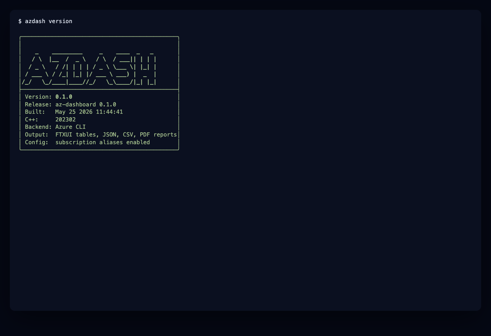
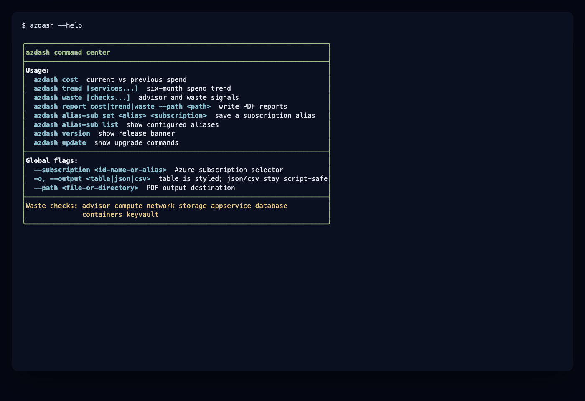
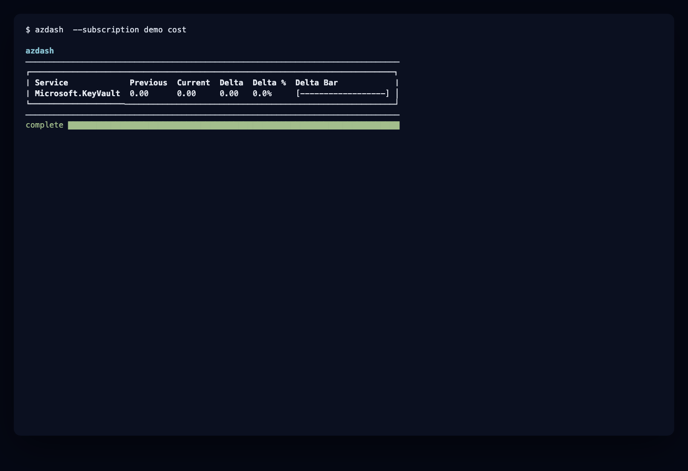
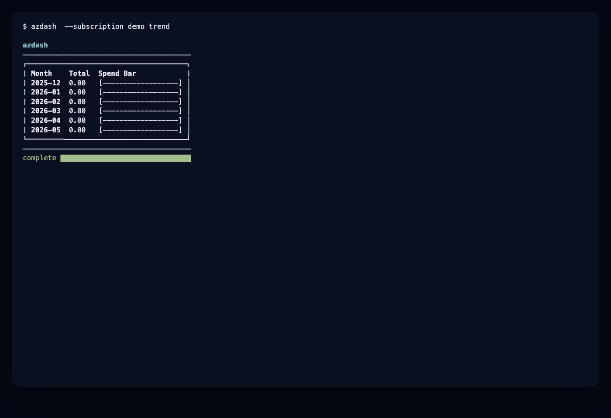
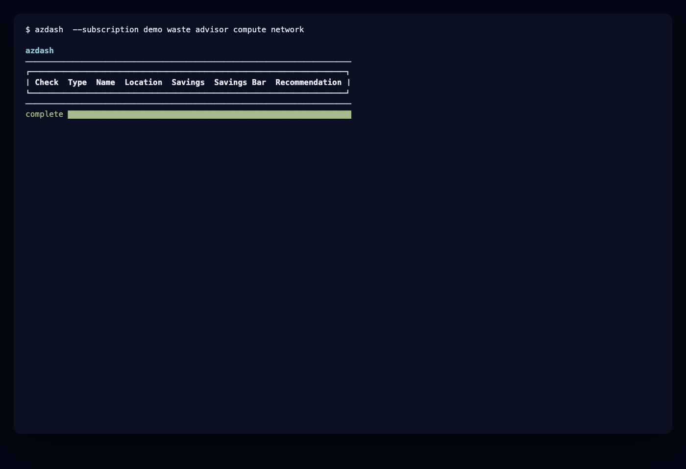
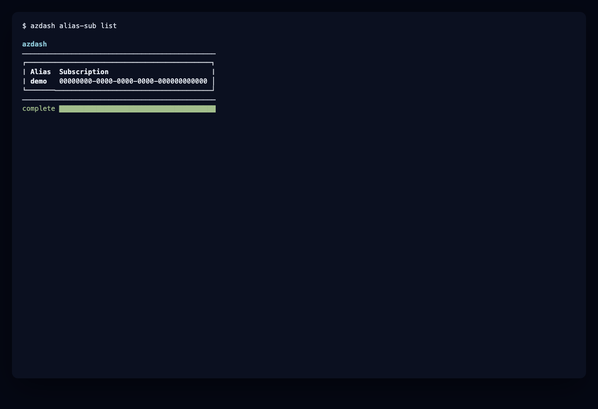
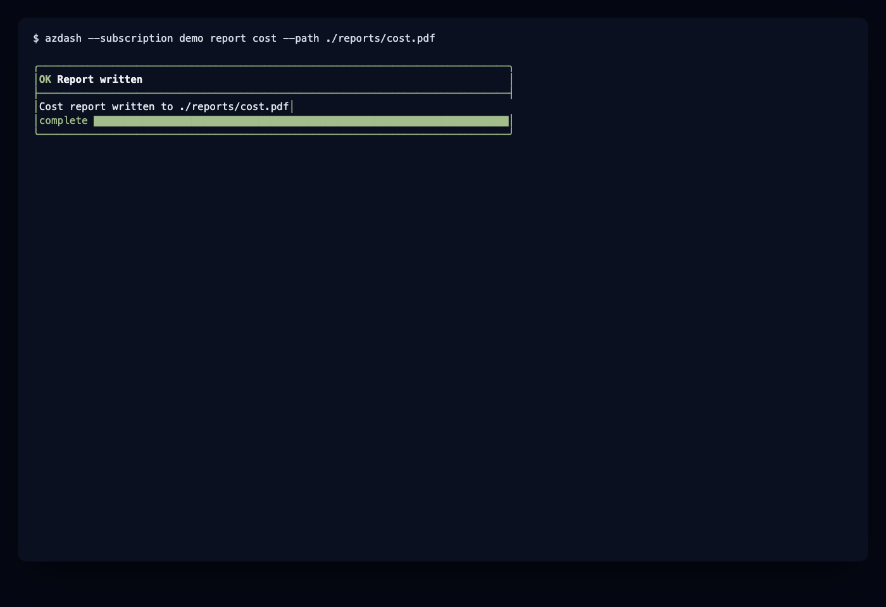

# azdash

[](https://github.com/stescobedo92/az-dashboard/actions/workflows/release.yml)
[](https://github.com/stescobedo92/az-dashboard/releases)
[](https://github.com/stescobedo92/az-dashboard/actions/workflows/npm-publish.yml)
[](https://github.com/stescobedo92/az-dashboard/actions/workflows/homebrew-publish.yml)
[](https://github.com/stescobedo92/az-dashboard/actions/workflows/vcpkg-publish.yml)
[](https://github.com/stescobedo92/az-dashboard/actions/workflows/winget-publish.yml)

`azdash` is an Azure-focused C++23 CLI. It audits Azure spending,
Six-month cost trends, and waste signals from Azure Advisor, plus resource
heuristics, then renders the results as an FTXUI table, JSON, CSV, or a PDF
report.

The implementation is intentionally layered:

- `AzureCliClient` gathers data through the official Azure CLI, so the core is
  easy to test without Azure credentials.
- `analytics` contains template-based generic helpers with concepts for
  aggregation and filtering.
- `render` owns FTXUI, JSON, and CSV presentation.
- `report` writes stakeholder-friendly PDF reports without requiring a browser.
- GTest covers parser, analytics, and report generation behavior.

## Features

- `link-account` verifies connectivity to the Azure CLI you signed in with and
  prints the active subscription, tenant, and user.
- Comparative cost analytics for current month versus the matching window in
  the previous month, plus a projected end-of-month total.
- Cost aggregation by service (default) or by resource group with
  `--group-by resource-group`.
- Six-month trend report with optional service filtering.
- Statistical cost anomaly detection: `azdash anomaly` scores the projected
  current month against the six-month baseline using a z-score.
- Local cost history: every `azdash cost` run records a snapshot under the user
  config directory, and `azdash history` lists past runs offline.
- Waste detection from `az advisor recommendation list --category Cost`.
- Extra Azure heuristics for unattached managed disks, orphan public IPs, old
  snapshots, and stopped or deallocated virtual machines.
- Selective scans by check name, for example `compute network advisor`.
- Local subscription aliases through `alias-sub` so long subscription IDs can be
  referenced by short names in later commands.
- Output formats: `table`, `json`, `csv`, and `markdown` (PR-comment friendly).
- Styled terminal tables with colors and inline progress bars for table output.
- PDF reports for cost, trend, and waste workflows.
- A reusable GitHub Action that posts the Markdown cost report on pull
  requests, with an optional cost gate.
- CMake, vcpkg manifest mode, Docker, CI build/test, and package publishing
  workflows for Homebrew, npm, winget, vcpkg, and release-native installers.

## Install

### Homebrew

```bash
brew install stescobedo92/tap/azdash
```

### npm

```bash
npm install -g @stescobedo9205/azdash
azdash version
```

The npm package exposes the CLI as the `azdash` command and downloads the
matching GitHub Release binary during installation.

### GitHub Releases

Each release publishes portable archives and native installer packages:

- Windows: `azdash-windows-x64.zip`
- Linux: `azdash-linux-x64.deb`, `azdash-linux-x64.rpm`,
  `azdash-ubuntu-latest.tar.gz`
- macOS: `azdash-macos.pkg`, `azdash-macos.dmg`,
  `azdash-macos-latest.tar.gz`

Download them from the
[GitHub Releases](https://github.com/stescobedo92/az-dashboard/releases) page.

### vcpkg

Coming soon. The package name is expected to be `stescobedo92-azdash`, with the
installed CLI command `azdash`, once the upstream vcpkg pull request is
approved.

### winget

Coming soon. The expected command is:

```powershell
winget install azdash
```

## Screenshots

The terminal UI is rendered with FTXUI for styled command panels, tables,
progress bars, success states, and errors. JSON and CSV output remain plain for
scripts.















More public-safe examples are available in `assets/screenshots`, including
alias lifecycle commands, update guidance, report generation, and error states.

## Requirements

- C++23 compiler.
- CMake 3.25 or newer.
- Ninja.
- vcpkg.
- Azure CLI authenticated with `az login`.

Azure cost data is read with `az consumption usage list`; Advisor data is read
with `az advisor recommendation list`. The Azure CLI documentation currently
marks Advisor recommendations as GA and Consumption as preview.

## Troubleshooting

- `link-account` fails with "failed to reach the Azure CLI": make sure the Azure
  CLI is installed and on `PATH`, and that `az login` succeeds. On Windows the
  CLI ships as `az.cmd`; azdash resolves and launches it for you.
- Cost or trend commands fail with `RBACAccessDenied`: your signed-in account
  lacks permission to read consumption data. Ask for the *Cost Management
  Reader* or *Billing Reader* role on the subscription, or target one where you
  hold it with `--subscription`. Run `azdash link-account` to confirm which
  account is active.

## Build

```bash
cmake -S . -B build -G Ninja \
  -DCMAKE_BUILD_TYPE=Release \
  -DCMAKE_TOOLCHAIN_FILE="$VCPKG_ROOT/scripts/buildsystems/vcpkg.cmake"

cmake --build build
ctest --test-dir build --output-on-failure
```

## Docker

```bash
docker build -t azdash .
docker run --rm -it -v "$HOME/.azure:/home/azdash/.azure:ro" azdash cost
```

## Usage

```bash
# Confirm azdash can reach the account you authenticated with `az login`
azdash link-account

# Cost comparison: current month vs previous matching window
azdash cost

# Cost breakdown by resource group instead of service
azdash --group-by resource-group cost

# JSON, CSV, or Markdown output
azdash --output json cost
azdash --output csv waste advisor compute
azdash --output markdown cost

# Statistical anomaly check against the six-month baseline
azdash anomaly

# Locally recorded snapshots of past cost runs
azdash history
azdash --output json history

# Create and use a local subscription alias
azdash alias-sub set prod "00000000-0000-0000-0000-000000000000"
azdash --subscription prod cost
azdash alias-sub list

# Use a specific subscription directly
azdash --subscription "00000000-0000-0000-0000-000000000000" trend

# Trend for selected services
azdash trend "Virtual Machines" "Storage"

# Waste checks
azdash waste
azdash waste advisor compute network

# PDF reports
azdash report cost --path ./reports
azdash report trend "Virtual Machines" --path ./reports/trend.pdf
azdash report waste compute network --path ./reports/waste.pdf

# Local version and update guidance
azdash version
azdash update
```

Cost snapshots are stored in `cost-history.json` next to the subscription alias
store: `AZDASH_CONFIG_HOME` when set, otherwise `XDG_CONFIG_HOME/azdash` or
`~/.config/azdash`.

## GitHub Action

The repository doubles as a composite GitHub Action that runs `azdash cost`,
adds the Markdown report to the job summary, and keeps a sticky comment updated
on pull requests. Authenticate with `azure/login` first:

```yaml
name: azure-cost-report
on:
  pull_request:

permissions:
  contents: read
  pull-requests: write
  id-token: write

jobs:
  cost:
    runs-on: ubuntu-latest
    steps:
      - uses: azure/login@v2
        with:
          client-id: ${{ secrets.AZURE_CLIENT_ID }}
          tenant-id: ${{ secrets.AZURE_TENANT_ID }}
          subscription-id: ${{ secrets.AZURE_SUBSCRIPTION_ID }}

      - uses: stescobedo92/az-dashboard@master
        with:
          github-token: ${{ secrets.GITHUB_TOKEN }}
          args: "--group-by resource-group"
          fail-if-exceeds: "500"
```

Inputs: `version` (release tag, defaults to the latest release), `args`
(extra `azdash cost` arguments), `fail-if-exceeds` (fails the job when the
current month cost crosses the amount), and `github-token` (omit it to skip
the PR comment). The rendered report is also exposed as the `report` output.
