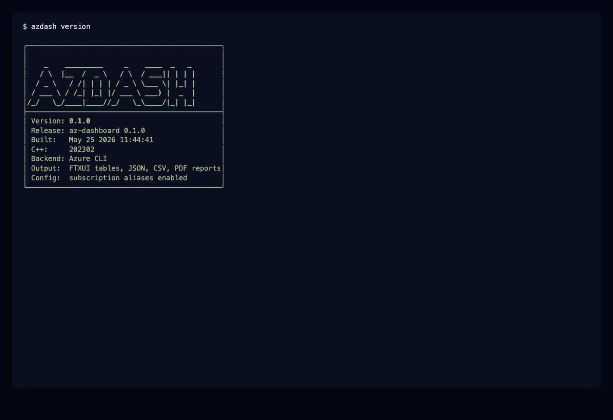
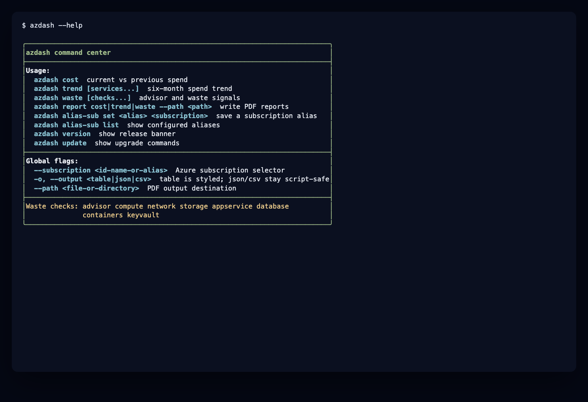
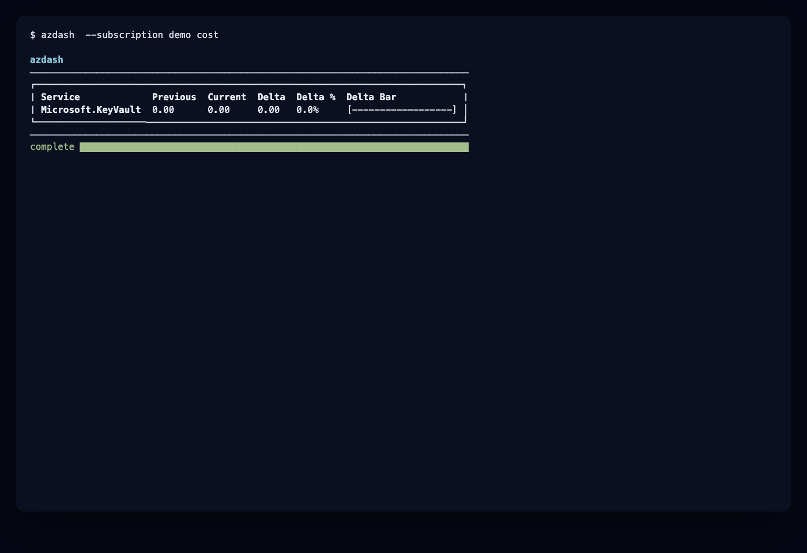
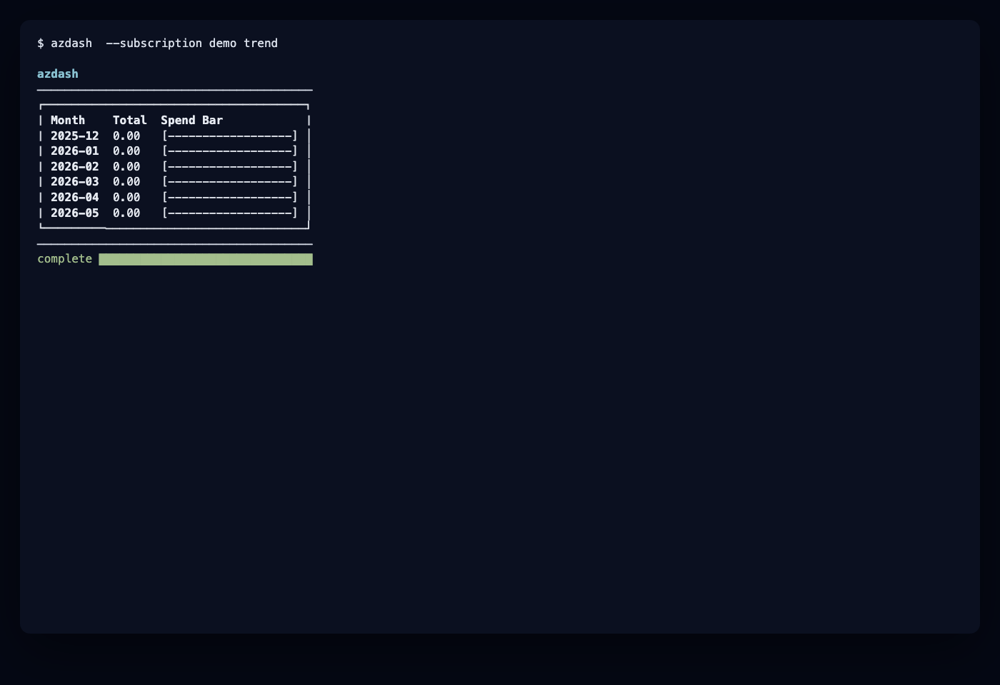
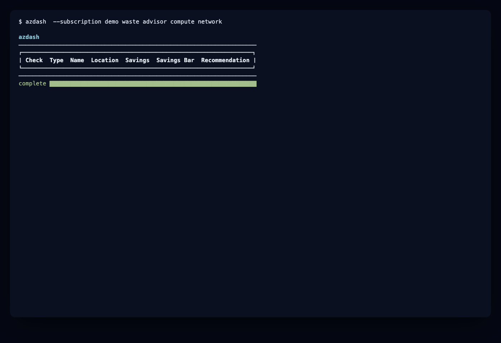
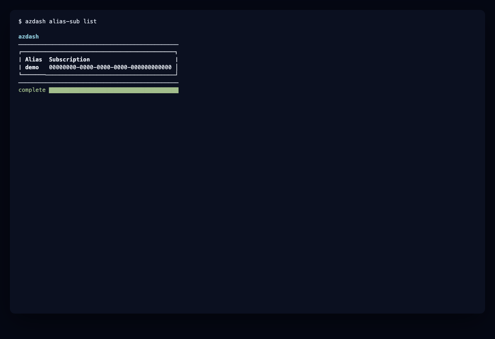
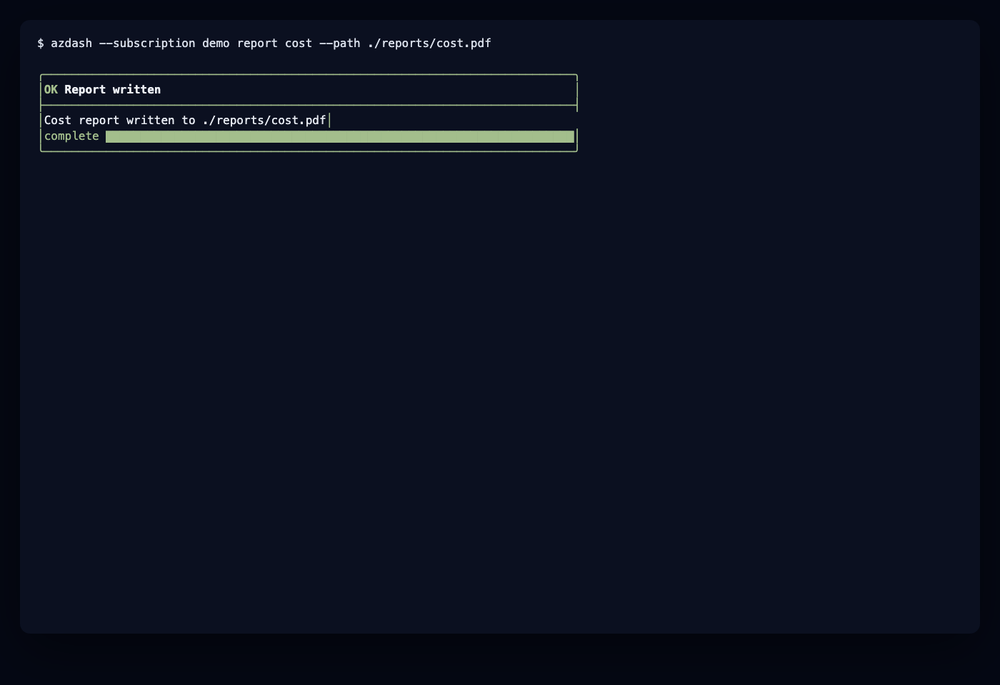

# azdash

[](https://github.com/stescobedo92/az-dashboard/actions/workflows/release.yml)
[](https://github.com/stescobedo92/az-dashboard/releases)
[](https://github.com/stescobedo92/az-dashboard/actions/workflows/npm-publish.yml)
[](https://github.com/stescobedo92/az-dashboard/actions/workflows/homebrew-publish.yml)
[](https://github.com/stescobedo92/az-dashboard/actions/workflows/vcpkg-publish.yml)
[](https://github.com/stescobedo92/az-dashboard/actions/workflows/winget-publish.yml)

`azdash` is an Azure-focused C++23 CLI. It audits Azure spending,
Six-month cost trends, and waste signals from Azure Advisor, plus resource
heuristics, then renders the results as an FTXUI table, JSON, CSV, or a PDF
report.

The implementation is intentionally layered:

- `IAzureClient` abstracts Azure data providers, allowing interchangeable backends:
  - `AzureCliClient` gathers data through the official Azure CLI.
  - `AzureRestClient` communicates directly with Azure ARM REST APIs (`management.azure.com`) via OAuth2 client credentials without requiring the Azure CLI or Python.
- `analytics` contains template-based generic helpers with concepts for aggregation, multi-tag filtering, anomaly detection, and Bayesian shrinkage projections.
- `cache` persists closed historical months locally with atomic writes to speed up repeat runs.
- `ui` provides a terminal user interface (TUI) powered by FTXUI with 4 tabs, drilldown, and sparklines.
- `webhook` sends structured alert notifications to Slack, Microsoft Teams, and generic JSON endpoints.
- `cli_parser` encapsulates CLI grammar, validation, and help formatting.
- `render` owns FTXUI, JSON, CSV, and Markdown presentation.
- `report` writes multi-page stakeholder-friendly PDF reports with headers and page numbering.
- GTest covers all modules with 166 comprehensive unit tests.

## Features

- **Interactive TUI Dashboard (`azdash ui`)**: Terminal GUI with 4 navigable tabs (`Cost Overview`, `6-Month Trends`, `Waste Findings`, `Account`), live sparklines, and detailed finding inspectors.
- **Direct Azure REST Client (`--rest`)**: Standalone mode using OAuth2 Service Principal credentials (`AZURE_CLIENT_ID`, `AZURE_CLIENT_SECRET`, `AZURE_TENANT_ID`) without needing Python or the Azure CLI.
- **Enterprise Budgets (`azdash budget`)**: Track consumption budgets against current spend with visual progress bars and exceeded indicators.
- **Commitments & Reservations Analysis (`azdash commitments` / `ri`)**: Compute Savings Plans and Reserved Instances (1-year / 3-year) recommendations with potential monthly savings calculations.
- **Management Groups Hierarchy (`--management-group` / `--mg`)**: Recursively query and aggregate costs across all subscriptions under an Azure Management Group.
- **Interactive Waste Remediation (`-i` / `--interactive`)**: Step-by-step interactive prompt to inspect and safely apply cleanup actions with full `--dry-run` simulation support.
- **Remediation Script Generator (`--generate-remediation <path>`)**: Automatically output executable bash scripts for remediating identified waste.
- **Extended FinOps Waste Heuristics**: Detects orphan NSGs, unused Route Tables, idle NAT Gateways ($32.40/mo savings), empty App Service Plans, unattached disks, orphan public IPs, and stopped VMs.
- **Advanced Multi-Tag Filtering (`--filter-tag`)**: Filter resources with syntax supporting exact matches (`k=v`), multi-value OR (`k=v1,v2`), negation (`k!=v`), existence (`k`), and absence (`!k`).
- **Tag Compliance Governance (`azdash compliance`)**: Audit Azure resources against required tags (`--required-tags`), measure unallocated untagged spend, generate auto-tag remediation scripts (`--generate-remediation`), and enforce CI/CD compliance gates (`--min-compliance <pct>`).
- **Responsive HTML Reports (`-o html`)**: Generate modern, standalone executive HTML dashboards for costs, trends, waste, budgets, commitments, and compliance.
- **6-Tab Interactive TUI Dashboard (`azdash ui`)**: Full-screen terminal dashboard covering Cost Drilldown, 6-Month Trends, Waste Findings, Budgets & Commitments, Tag Governance, and Account & Aliases.
- **Persistent Configuration (`.azdashrc` / `azdash.json` / `--config`)**: Automatic configuration discovery from local directory or `~/.azdash/config.json` with CLI flag override precedence.
- **Server-Side JMESPath Projection (`--fast`)**: Trim 80-90% of payload bandwidth by projecting fields directly within Azure CLI queries.
- **Local Trend Caching (`--no-cache` to bypass)**: Cache finalized historical billing months in local storage with atomic writes for instant trend reports.
- **Webhook Alerts (`--webhook <url>`)**: Automatic notifications with severity coloring dispatched to Slack, Microsoft Teams (MessageCards), or generic JSON endpoints.
- **Bayesian Weighted Cost Projections (`--projection weighted`)**: Shrinkage model accounting for end-of-month acceleration and historical spending patterns.
- **Multi-Currency Propagation**: Native detection of Azure `billingCurrency` across all views, tables, JSON exports, and PDF reports.
- **Multi-page PDF Reports**: Dynamically paginated PDF reports with repeating table headers and `Page X of Y` footers.
- **Local Subscription Aliases (`alias-sub`)**: Map long subscription GUIDs to friendly short names.

## Install

### Homebrew

```bash
brew install stescobedo92/tap/azdash
```

### npm

```bash
npm install -g @stescobedo9205/azdash
azdash version
```

The npm package exposes the CLI as the `azdash` command and downloads the
matching GitHub Release binary during installation.

### GitHub Releases

Each release publishes portable archives and native installer packages:

- Windows: `azdash-windows-x64.zip`
- Linux: `azdash-linux-x64.deb`, `azdash-linux-x64.rpm`,
  `azdash-ubuntu-latest.tar.gz`
- macOS: `azdash-macos.pkg`, `azdash-macos.dmg`,
  `azdash-macos-latest.tar.gz`

Download them from the
[GitHub Releases](https://github.com/stescobedo92/az-dashboard/releases) page.

### vcpkg

Coming soon. The package name is expected to be `stescobedo92-azdash`, with the
installed CLI command `azdash`, once the upstream vcpkg pull request is
approved.

### winget

Coming soon. The expected command is:

```powershell
winget install azdash
```

## Screenshots

The terminal UI is rendered with FTXUI for styled command panels, tables,
progress bars, success states, and errors. JSON and CSV output remain plain for
scripts.















More public-safe examples are available in `assets/screenshots`, including
alias lifecycle commands, update guidance, report generation, and error states.

## Requirements

- C++23 compiler.
- CMake 3.25 or newer.
- Ninja.
- vcpkg.
- Azure CLI authenticated with `az login`.

Azure cost data is read with `az consumption usage list`; Advisor data is read
with `az advisor recommendation list`. The Azure CLI documentation currently
marks Advisor recommendations as GA and Consumption as preview.

## Troubleshooting

- `link-account` fails with "failed to reach the Azure CLI": make sure the Azure
  CLI is installed and on `PATH`, and that `az login` succeeds. On Windows the
  CLI ships as `az.cmd`; azdash resolves and launches it for you.
- Cost or trend commands fail with `RBACAccessDenied`: your signed-in account
  lacks permission to read consumption data. Ask for the *Cost Management
  Reader* or *Billing Reader* role on the subscription, or target one where you
  hold it with `--subscription`. Run `azdash link-account` to confirm which
  account is active.

## Build

```bash
cmake -S . -B build -G Ninja \
  -DCMAKE_BUILD_TYPE=Release \
  -DCMAKE_TOOLCHAIN_FILE="$VCPKG_ROOT/scripts/buildsystems/vcpkg.cmake"

cmake --build build
ctest --test-dir build --output-on-failure
```

## Docker

```bash
docker build -t azdash .
docker run --rm -it -v "$HOME/.azure:/home/azdash/.azure:ro" azdash cost
```

## Usage

```bash
# Launch the interactive terminal UI (FTXUI 4-tab dashboard)
azdash ui

# Confirm azdash can reach the account you authenticated with `az login`
azdash link-account

# Cost comparison: current month vs previous matching window
azdash cost

# Use Bayesian weighted projection instead of linear
azdash --projection weighted cost

# Direct Azure REST API mode (without Azure CLI, using OAuth2 SP credentials)
azdash --rest cost

# Filter costs by Azure tag expressions (e.g. Env=Prod or multi-value)
azdash --filter-tag "Environment=Production" cost

# Target an entire Azure Management Group recursively
azdash --management-group "mg-enterprise" cost

# Cost breakdown by resource group instead of service
azdash --group-by resource-group cost

# Track consumption budgets and threshold progress
azdash budget
azdash --budget "Q3-Production" budget

# Commitments analysis (Compute Savings Plans and Reserved Instances)
azdash commitments
azdash ri --term 3yr --min-savings 100

# Tag compliance governance audit & cost allocation
azdash compliance
azdash compliance --required-tags "Environment,Owner,CostCenter,Application"
azdash --min-compliance 85.0 compliance  # Return exit code 2 if compliance < 85%
azdash --generate-remediation ./fix_tags.sh compliance  # Output az resource tag script

# Load configuration defaults (.azdashrc, azdash.json, or custom path)
azdash --config ./finops-team.json cost

# Generate executive responsive HTML dashboards
azdash -o html cost > cost_report.html
azdash -o html compliance > compliance_report.html

# Send Slack / Teams alert notifications upon budget overrun, anomalies, or compliance breaches
azdash --webhook "https://hooks.slack.com/services/..." --fail-if-exceeds 1000 cost
azdash --webhook "https://hooks.slack.com/services/..." --min-compliance 90 compliance

# JSON, CSV, or Markdown output
azdash --output json cost
azdash --output csv waste advisor compute
azdash --output markdown cost

# Statistical anomaly check against the six-month baseline
azdash anomaly

# Interactive waste remediation with confirmation prompt
azdash -i waste

# Generate automated cleanup script with dry-run simulation
azdash --dry-run --generate-remediation ./cleanup.sh waste

# Locally recorded snapshots of past cost runs
azdash history
azdash --output json history

# Create and use a local subscription alias
azdash alias-sub set prod "00000000-0000-0000-0000-000000000000"
azdash --subscription prod cost
azdash alias-sub list

# Use a specific subscription directly
azdash --subscription "00000000-0000-0000-0000-000000000000" trend

# Fast server-side projection to reduce Azure CLI bandwidth
azdash --fast trend "Virtual Machines" "Storage"

# Waste checks
azdash waste
azdash waste advisor compute network

# PDF reports
azdash report cost --path ./reports
azdash report trend "Virtual Machines" --path ./reports/trend.pdf
azdash report waste compute network --path ./reports/waste.pdf

# Local version and update guidance
azdash version
azdash update
```

Cost snapshots are stored in `cost-history.json` next to the subscription alias
store: `AZDASH_CONFIG_HOME` when set, otherwise `XDG_CONFIG_HOME/azdash` or
`~/.config/azdash`.

## GitHub Action

The repository doubles as a composite GitHub Action that runs `azdash cost`,
adds the Markdown report to the job summary, and keeps a sticky comment updated
on pull requests. Authenticate with `azure/login` first:

```yaml
name: azure-cost-report
on:
  pull_request:

permissions:
  contents: read
  pull-requests: write
  id-token: write

jobs:
  cost:
    runs-on: ubuntu-latest
    steps:
      - uses: azure/login@v2
        with:
          client-id: ${{ secrets.AZURE_CLIENT_ID }}
          tenant-id: ${{ secrets.AZURE_TENANT_ID }}
          subscription-id: ${{ secrets.AZURE_SUBSCRIPTION_ID }}

      - uses: stescobedo92/az-dashboard@master
        with:
          github-token: ${{ secrets.GITHUB_TOKEN }}
          args: "--group-by resource-group"
          fail-if-exceeds: "500"
```

Inputs: `version` (release tag, defaults to the latest release), `args`
(extra `azdash cost` arguments), `fail-if-exceeds` (fails the job when the
current month cost crosses the amount), and `github-token` (omit it to skip
the PR comment). The rendered report is also exposed as the `report` output.
